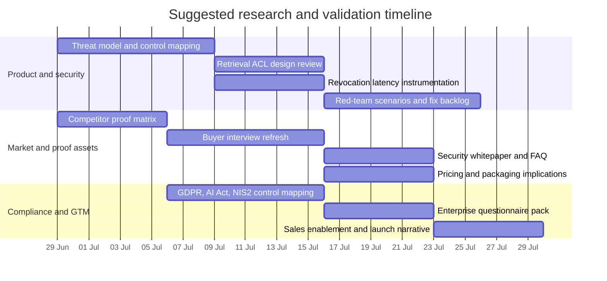

# Deep Research Full Report — Permission Architecture & Market Research

**Status:** Source material (unprocessed)  
**Date:** 2026-06-25  
**Phase:** Discovery  
**Relation:** This is the full output from the Deep Research session. The processed, decision-oriented version lives in `docs/discovery/02-market-research.md`.  
**Usage:** Reference this document when verifying a specific finding, a competitor's documentation, or a research citation. Do not read this as a plan of action.

---

## Executive summary

This report interprets the uploaded brief as a request to evaluate whether ClarityHubs proposed architecture can be differentiated from major enterprise AI search and knowledge competitors on the basis of permission enforcement, security posture, and enterprise readiness. The original generic instruction referred to an unspecified topic, but the actual brief specifies a concrete topic: ClarityHub permission model, competitor architectures, regulatory fit, and go to market implications. The analysis therefore uses that specified brief as the governing scope.

The highest confidence conclusion is that the narrow thesis, namely that competitors mostly retrieve broad candidate sets and only apply permissions after retrieval, is **not supported as a general market claim**. At least two major competitors publicly describe stronger controls than that. Notion states that Enterprise Search permissions are checked **at query time, not just during indexing**. Elastic documents document level and field level security directly in the search engine and shows how Workplace Search permissions flow into signed search filters. Microsoft presents a mixed model: native Microsoft 365 content and Microsoft Graph connector items are access controlled, while external connector architecture now splits into **synced** connectors, which are indexed into Microsoft Graph, and **federated** connectors, which are fetched in real time. That means the market already contains both indexed and query time models. citeturn40view0turn18view0turn18view2turn12view0turn15view1turn11view0

What *is* still differentiable for ClarityHub is not the generic idea of “permission aware AI”, but a more precise proposition: **provable retrieval time authorisation, low revocation latency, explicit source of truth mappings, auditable enforcement, and layered controls that do not depend on the LLM to reason about access rules**. Recent research strengthens that position. Work on role based access control for organisational LLMs shows current models perform poorly on complex authorisation reasoning, and recent security papers on enterprise copilots show prompt injection and confused deputy style attacks can turn weakly isolated RAG systems into confidentiality risks. citeturn17academia2turn43academia4turn43academia2

The market signal is strong even though precise public TAM numbers for this exact segment are noisy. Reuters coverage shows sustained investor demand for enterprise AI search and knowledge platforms, with Glean valued at $2.2 billion in February 2024 and $4.6 billion by September 2024, while broader data infrastructure and enterprise AI spending remain robust. At the same time, adoption barriers are real. Gartner reporting cited by Business Insider found oversharing and security concerns materially delayed Microsoft 365 Copilot deployments, and user studies show value is highly task dependent and still requires human validation. citeturn59news3turn59news1turn44news8turn49news2turn49academia12turn43academia3

For ClarityHub, the practical recommendation is to position around **security evidence, revocation speed, explainability, and compliance grade governance**, not around a claim that competitors all rely on post retrieval filtering. In product terms, that means building a hybrid architecture with retrieval integrated ACL or ABAC enforcement, federated mode for high sensitivity systems, explicit permission delta pipelines, DLP or policy masks on top of authorisation, and detailed audit trails that make enforcement explainable to enterprise buyers and auditors. citeturn40view0turn18view0turn15view1turn23view0turn34view0turn53view0turn54view4turn58view0

## Mandate and assumptions

The brief asks for a rigorous report that is able to validate or disprove the internal premise behind ClarityHub, namely that competitor enterprise AI search products often index content broadly, then narrow access only after retrieval, creating leakage or stale permission risk. It also asks for competitor comparison across Glean, Microsoft Copilot for Microsoft 365, Guru, Notion AI, and Elastic Enterprise Search; literature review; market sizing; regulatory implications; and practical recommendations. Because the uploaded brief is specific, this report does **not** treat the topic as unspecified in practice. Instead, it notes that the user’s generic meta instruction was superseded by the detailed brief. 

Several assumptions were necessary. First, only public documentation, public research papers, and publicly available media coverage were used. That means any vendor behaviour that is only documented in private trust centres, customer NDAs, or security questionnaires cannot be verified here. Second, “permission architecture” is treated as including four possible control points: source side permissions, index time ACL attachment, retrieval time filtering, and generation time masking or policy filtering. Third, where vendors use marketing language such as “permission aware AI”, the claim is treated as weaker evidence than detailed implementation documentation. Fourth, precise market size for “enterprise AI search plus permission aware knowledge retrieval” is not consistently published as a single category, so the market view below uses adjacent signals, including enterprise AI spending, data infrastructure investment, and company growth or valuation data, rather than pretending that one clean public TAM estimate exists. citeturn23view0turn23view2turn34view0turn40view0turn44news8turn49news7turn59news1turn59news3

The research method prioritised primary and official sources where possible. Competitor architecture findings come mainly from Microsoft Learn, Notion Help, Elastic Docs, Glean Developer documentation, Guru security documentation, and official corporate security pages. Regulatory findings come mainly from the European Commission, the Council of the EU, and the UK ICO. Technical and risk synthesis is anchored in recent primary research papers on RAG security and organisation scale authorisation. Where a point rests on secondary reporting, that is stated or reflected in the evidence strength table. citeturn12view0turn15view1turn40view0turn18view0turn18view2turn25view0turn34view0turn53view0turn54view4turn58view0turn17academia1turn17academia2turn43academia2turn43academia4

## Competitive architecture review

The strongest competitor documentation comes from Notion, Elastic, and Microsoft. Notion’s current Enterprise Search documentation states that connected app data is embedded and stored in a vector database, that results are filtered based on user access rights in both Notion and connected apps, and, crucially, that **permissions are checked at query time, not just during indexing**. Notion also states that source permission changes are reflected within about one hour, though it notes large workspaces may take longer. That means Notion directly contradicts the idea that all major competitors only rely on post retrieval permission cleanup. citeturn40view0

Elastic also documents stronger than assumed controls. At the search engine layer, Elasticsearch supports document level security and field level security inside role definitions, with per role query filters and support for templated user attributes. In Workplace Search, Elastic states that document level permissions are designed to ensure proper visibility and that superadmin based connectors can synchronise access information alongside indexed content. Elastic’s guidance for building search experiences from Workplace Search content further shows that signed keys can carry embedded permission filters such as `_allow_permissions`, which are applied to search. This is not the same pattern as retrieving everything and relying only on a late LLM stage scrub. citeturn18view0turn19view0turn19view1

Microsoft is more complex because the product surface has broadened. Microsoft states that Microsoft 365 Copilot works only with data that the user can access and stays within existing Microsoft 365 permissioning. For external data, the current connector model now has two modes. **Synced connectors** ingest and index content into Microsoft Graph, support semantic indexing, and use external item ACLs that specify grant and deny access. **Federated connectors** do not index data into Microsoft Graph and instead retrieve content in real time through MCP based integrations. Microsoft also recommends event based sync for dynamic or sensitive data in synced connectors. The practical implication is that Microsoft does not embody one single model. It uses indexed plus ACL controls for some content, and query time federation for others. That hybrid model is strategically important because it mirrors the direction enterprise buyers increasingly expect. citeturn11view0turn12view0turn15view1

Glean and Guru both publicly market permission aware behaviour, but their public technical detail is thinner. Glean’s developer site says “every query respects your company's access controls”, and its Indexing API includes explicit permissions endpoints for users, groups, and memberships to manage content visibility in search results. Glean’s security page also emphasises enforced data permissions, single tenant connectors, sensitive content policies, and agent access controls. That is enough to conclude that permission management is a first class design concern, but not enough to prove exactly whether enforcement happens inside vector retrieval, in a pre search filter, in a result set gate, or as multiple stages. citeturn41view0turn25view0turn24view3

Guru’s public material is similar. Guru states that users will only see what they already have permission to see, that it uses role based access control, and that only relevant document matches are submitted to the third party LLM. It also advertises DLP masking at ingestion, which can redact sensitive data before storage, indexing, or AI answers. Those are meaningful safeguards. However, from public material alone it is not possible to verify whether Guru’s access enforcement is implemented directly inside retrieval, before ranking, or just before answer assembly. In other words, Guru’s public posture appears aligned with defence in depth, but the exact retrieval path remains under specified. citeturn34view0turn35view1

The practical synthesis is that the competitors split into three groups. Notion and Elastic provide explicit evidence of integrated authorisation controls in retrieval or search. Microsoft provides an intentional hybrid across indexed and federated modes. Glean and Guru clearly support permission aware operation but do not publicly expose enough implementation detail for a precise architectural verdict. ClarityHub should therefore avoid claiming a universal competitor weakness unless it can document a more exact and testable claim, such as better revocation latency, stronger source of truth integrity, or retrieval stage explainability. citeturn40view0turn18view0turn12view0turn25view0turn34view0

### Competitor evidence comparison

| Competitor | Publicly described enforcement model | What the documentation supports | What remains unclear | Evidence strength |
|---|---|---|---|---|
| Microsoft 365 Copilot | Native permissions plus indexed and federated connector models | Existing user permissions apply; synced connectors use Microsoft Graph ACLs; federated connectors fetch content in real time; dynamic data should prefer event based sync. citeturn11view0turn12view0turn15view1 | Revocation latency for each Microsoft first party surface is not fully uniform from public docs. | High |
| Notion AI Enterprise Search | Query time permission validation on connected apps | Permissions checked at query time, not just during indexing; results filtered by both Notion and source app access rights; permission changes typically reflected within one hour. citeturn40view0turn39view0 | Exact internal candidate selection and ranking path before final filter is not described in full. | High |
| Elastic | Search engine level DLS and FLS plus Workplace Search permission sync | Role queries enforce document level security; field level security exists; Workplace Search syncs permission data; signed keys can carry permission filters. citeturn18view0turn19view0turn19view1 | Exact latency of source permission revocation depends on connector and sync design. | High |
| Glean | Permission aware search with explicit permissions APIs | Public claims that every query respects access controls; API supports users, groups, memberships, and dynamic permission updates. citeturn41view0turn25view0 | Exact enforcement point in retrieval stack is not exposed in public docs. | Medium |
| Guru | Role based access control and controlled LLM context | Users see only what they already have permission to see; only relevant document matches are sent to the LLM; DLP masking can occur before storage and indexing. citeturn34view0turn35view1 | Exact stage of retrieval path where RBAC is enforced is not described in enough detail. | Medium |

### Conflicting findings and what they mean

| Question | Evidence suggesting stronger architecture | Evidence suggesting remaining risk | Interpretation |
|---|---|---|---|
| Do competitors only filter after retrieval? | Notion explicitly says permissions are checked at query time. Elastic embeds security constraints in the search engine itself. citeturn40view0turn18view0 | Some vendors do not expose enough detail to verify internal order of retrieval and filtering. citeturn25view0turn34view0 | The broad claim is false. The more defensible claim is that **some vendors remain opaque** about enforcement internals. |
| Does indexing inherently create stale permission risk? | Microsoft external items carry ACLs and Microsoft recommends event based sync for dynamic data. Notion says permission changes are reflected within roughly one hour. citeturn15view1turn40view0 | Any sync driven design can lag source changes. Notion openly discloses up to one hour in some cases. Microsoft synced connectors depend on crawl or event design. citeturn15view1turn40view0 | Indexed designs are viable, but revocation latency becomes a major product and risk variable. |
| Can LLMs themselves reliably enforce complex access rules? | None of the vendors rely publicly on the model alone. Research shows explicit access structures matter. citeturn17academia2turn43academia4 | Benchmarks show modern LLMs struggle with complex organisational permission reasoning. citeturn17academia2 | ClarityHub should treat authorisation as a systems problem, not a prompt problem. |
| Are permission controls enough for enterprise AI security? | Vendors layer DLP, masking, zero retention, and governance on top of permissioning. citeturn23view0turn34view0turn40view0 | Prompt injection and data exfiltration research shows permissioning alone does not fully eliminate RAG risk. citeturn43academia2turn43academia4turn43news0 | The right position is defence in depth, not “permissions alone”. |

## Literature and market synthesis

Recent primary research strongly favours a security architecture in which access control is explicit, system enforced, and separate from the language model’s own reasoning. The 2025 **OrgAccess** benchmark finds that even frontier models struggle to maintain correct behaviour under complex organisational permission structures, with GPT 4.1 performing poorly on harder permission combinations. The implication for ClarityHub is direct: permission logic should live in deterministic systems, not in natural language instructions. citeturn17academia2

A parallel body of work focuses on secure retrieval systems rather than model judgement. The 2025 **HoneyBee** paper shows that access control in vector databases creates a difficult trade off. Per user indexes improve isolation but explode storage. Single index approaches with row or post filtering reduce storage but can hurt latency and recall. The paper proposes role aware dynamic partitioning as a middle ground. For ClarityHub, that means architectural differentiation could credibly focus on **how** permission aware retrieval is implemented, not just whether it exists. citeturn17academia1

Security research on enterprise RAG systems also supports a defence in depth position. The 2024 **ConfusedPilot** paper identifies confidentiality and integrity weaknesses in RAG based copilots, including attacks that exploit retrieval and caching behaviour. The 2025 **EchoLeak** case study documents a real world zero click prompt injection exploit in Microsoft 365 Copilot and argues for clearer trust boundary separation, provenance controls, and stricter output isolation. In June 2026, security reporting on the **SearchLeak** issue described another Microsoft 365 Copilot data exfiltration chain that Microsoft patched. Even where identity permissions are correct, these cases show that RAG systems still need anti injection, anti exfiltration, and safe rendering controls. citeturn43academia4turn43academia2turn43news0

Adoption evidence is more mixed. Two recent studies on Microsoft 365 Copilot report that users value the tool for structured, text heavy tasks, but productivity, perceived usefulness, and trust differ by role and by maturity of deployment. Human oversight remains necessary because output quality and contextual reliability vary. This aligns with Gartner findings, reported by Business Insider, that oversharing and security concerns delayed Copilot deployments in many organisations. The adoption lesson is not that enterprise AI has weak demand. It is that buyers are increasingly willing to pay only when governance, data preparation, and measurable value are credible. citeturn49academia12turn43academia3turn49news2

On market direction, the enterprise AI knowledge layer is clearly strategic even if category boundaries are fuzzy. Reuters reported strong investor demand for Glean in 2024, with valuation moving from $2.2 billion in February to $4.6 billion in September. Reuters also reported in 2025 that data infrastructure assets were becoming strategically valuable as major software and cloud players raced to secure better data foundations for AI. IDC projected in 2024 that AI would add $19.9 trillion to the global economy by 2030, which is a very broad macro estimate rather than a specific enterprise search TAM, but it does reinforce the direction of travel. The defensible summary is that the segment is economically important and expanding, but public market sizing for this exact niche remains inconsistent across firms and definitions. citeturn59news3turn59news1turn44news8turn49news7

### Recent source review

| Source | Type | Why it matters for ClarityHub | Relevance |
|---|---|---|---|
| Notion Enterprise Search security and privacy practices, 2026. citeturn40view0 | Official vendor documentation | Direct competitor evidence on embeddings, vector database use, query time permission checks, and revocation latency. | Very high |
| Microsoft 365 Copilot connectors overview and Graph external item ACL docs, 2024 to 2026. citeturn12view0turn15view1 | Official vendor documentation | Shows hybrid connector architecture, ACL structure, sync strategies, and federated real time mode. | Very high |
| Elastic document and field level security and Workplace Search permissions docs. citeturn18view0turn19view0turn19view1 | Official vendor documentation | Provides explicit query level enforcement examples and permission aware search filtering patterns. | Very high |
| Glean developer permissions overview and security pages. citeturn25view0turn41view0turn24view3 | Official vendor documentation | Confirms permission APIs and permission aware positioning, while leaving internal enforcement order under specified. | High |
| Guru security page and product site. citeturn34view0turn35view1 | Official vendor documentation | Shows RBAC, restricted LLM context, and DLP masking at ingestion. | High |
| OrgAccess, 2025. citeturn17academia2 | Primary research paper | Demonstrates LLM weakness on organisational permission reasoning. | Very high |
| HoneyBee, 2025. citeturn17academia1 | Primary research paper | Explains performance and storage trade offs in permission aware vector retrieval. | Very high |
| ConfusedPilot, 2024 and EchoLeak, 2025. citeturn43academia4turn43academia2 | Primary research papers | Establish real confidentiality risks in enterprise RAG systems despite existing guardrails. | Very high |
| Microsoft Copilot user studies, 2025 to 2026. citeturn49academia12turn43academia3 | Primary research papers | Show adoption depends on use case fit, training, and human oversight. | High |
| Gartner findings reported by Business Insider, 2024. citeturn49news2 | Secondary analyst reporting | Useful evidence that oversharing and security concerns slow procurement. | Medium |
| AI Act official Commission summary, 2026. citeturn54view4turn54view3 | Official regulator summary | Sets timing and risk logic for AI compliance obligations relevant to enterprise product roadmaps. | Very high |
| ICO security guidance and Council of the EU cybersecurity summary. citeturn53view0turn58view0 | Official regulator guidance | Anchors GDPR style security expectations and NIS2 era cybersecurity obligations. | High |

## Strategic implications and recommendations

The central strategic implication is that ClarityHub should **not** frame its differentiation around a simplistic market accusation. A stronger and more credible message is: *enterprise AI systems need retrieval integrated authorisation, rapid permission revocation, content safety layers on top of access controls, and auditable enforcement that can be explained to buyers, security teams, and regulators*. That message is consistent with the public evidence and with current research. citeturn40view0turn18view0turn15view1turn17academia2turn43academia4

From a product architecture perspective, the recommended design is a **hybrid enforcement model**. Indexed content should carry explicit principal and group metadata, but retrieval itself should also accept a user or role constrained security predicate, so that candidate generation is authorisation aware from the start. For regulated or rapidly changing sources, ClarityHub should support a federated mode that leaves sensitive data in the source system and resolves access against the live source at query time. Generation time policy checks should remain in place, but only as a second line of defence, not the main authorisation mechanism. This direction is reinforced both by Microsoft’s split connector model and by research showing the limits of post hoc LLM level control. citeturn12view0turn15view1turn17academia1turn17academia2turn43academia2turn43academia4

For enterprise procurement, ClarityHub should make **revocation latency** a headline metric. Notion’s public disclosure that permission changes may take up to about an hour is valuable because it gives buyers something concrete to compare. ClarityHub can differentiate if it can prove materially faster propagation, preferably near real time for critical systems and within minutes for ordinary indexed content. This should be exposed in admin dashboards and audit logs, not hidden in architecture diagrams. citeturn40view0

ClarityHub should also invest early in **security observability**. Recent exploit literature shows that correct user permissions do not remove prompt injection or exfiltration risk. Product requirements should therefore include provenance tracking on retrieved chunks, output rendering sanitisation, link and image handling controls, anomaly detection for suspicious retrieval patterns, and policy engines that can block the model from answering on especially sensitive topics even when a user nominally has access. Glean’s and Guru’s emphasis on sensitive content policies, DLP masking, and agent guardrails suggests buyers already expect this layer. citeturn23view0turn34view0turn43academia2turn43academia4turn43news0

The regulatory consequences reinforce this roadmap. GDPR style security guidance requires appropriate technical and organisational measures, confidentiality, integrity, availability, access restriction, restoration, and regular testing. The AI Act’s transparency and GPAI obligations are already partially in force, and the broader framework becomes fully applicable from 2 August 2026, with some high risk rules on later dates. NIS2 has broadened EU cybersecurity obligations and incident handling expectations. In practice, enterprise buyers will increasingly expect retrieval layers, audit trails, testing processes, and incident response to be visible in security reviews. ClarityHub therefore needs not only a good architecture, but also a governance package that maps the architecture to buyer checklists. citeturn53view0turn54view4turn54view3turn58view0

### Recommended actions

| Recommendation | What to do | Why it matters |
|---|---|---|
| Make retrieval authorisation explicit | Enforce ACL or ABAC filters inside candidate retrieval, not only after ranking or generation. | This is the clearest technical answer to both research and market concerns. citeturn18view0turn40view0turn17academia1turn17academia2 |
| Support federated mode for sensitive systems | Offer live source retrieval for HR, legal, finance, and high churn collaboration systems. | Microsoft and Notion both show that hybrid models are increasingly normal. citeturn12view0turn40view0 |
| Publish revocation SLAs | Expose target and observed permission propagation times in product and marketing. | This creates a measurable and believable differentiator against opaque competitors. citeturn40view0turn25view0turn34view0 |
| Add policy and DLP layers above permissions | Mask or block especially sensitive classes even for authorised users where policy demands it. | Permissions alone do not solve oversharing or misuse problems. citeturn23view0turn34view0turn43academia4 |
| Build audit grade explainability | Log which identities, groups, source permissions, and filters produced each answer. | This improves procurement confidence and regulatory defensibility. citeturn53view0turn58view0 |
| Test against attack patterns | Red team prompt injection, cross source confusion, stale ACLs, and rendering exfiltration. | Recent real world research shows these are not hypothetical risks. citeturn43academia2turn43academia4turn43news0 |
| Refine positioning | Market ClarityHub as “provable, auditable, low latency enterprise retrieval security”, not just “permission aware AI”. | The latter language is already crowded across competitors. citeturn23view0turn34view0turn40view0 |

## Delivery plan and next steps

The most useful next deliverables are not more generic market slides. They are buyer facing proof assets and internal validation outputs. The first should be a **security architecture brief** that maps every control point from source system to final answer. The second should be a **competitive proof matrix** showing exactly where ClarityHub can and cannot make stronger claims than Microsoft, Notion, Elastic, Glean, and Guru. The third should be a **revocation latency and leakage benchmark**, since that is where product differentiation becomes measurable. The fourth should be a **compliance mapping pack** for GDPR, AI Act, NIS2, SOC 2 style audits, and ISO 27001 style procurement reviews. citeturn40view0turn15view1turn18view0turn53view0turn54view4turn58view0

A practical eight week work plan is below. The timing is intentionally short because the highest value work is validation, not more abstract theorising.

### Suggested deliverables

| Deliverable | Content | Suggested timing |
|---|---|---|
| Architecture decision memo | Retrieval path, ACL model, federated versus indexed source policy, failure modes | Week one to week two |
| Security benchmark report | Permission revocation timings, stale ACL scenarios, prompt injection and exfiltration tests | Week three to week five |
| Competitive proof pack | Claim by claim comparison with citations, including what ClarityHub can safely state publicly | Week two to week four |
| Compliance crosswalk | GDPR security principle, AI Act timeline and governance, NIS2 incident and resilience controls, plus audit artefacts | Week three to week six |
| Buyer facing whitepaper | Clear narrative on “why retrieval time authorisation matters” with diagrams and FAQs | Week five to week seven |
| Sales enablement kit | Objection handling, evaluation checklist, security review answers, pricing implications | Week six to week eight |

### Open questions and limitations

Public evidence is incomplete for Glean and Guru at the exact enforcement point level. Their public materials clearly claim permission aware operation and expose permission management features, but they do not provide enough public technical detail to conclude whether filtering is embedded directly in retrieval, applied in pre ranking stages, or enforced only later in the pipeline. citeturn25view0turn34view0

Public market sizing for the exact category “enterprise AI search plus secure permission aware knowledge retrieval” remains fragmented. The strongest evidence available publicly is directional rather than precise. It shows rapid investment, strong valuations, and strategic importance, but not one universally accepted category TAM. citeturn59news1turn59news3turn44news8turn49news7

Some of the most important procurement evidence, especially detailed customer complaints on G2, Gartner Peer Insights, private trust centres, and enterprise security questionnaires, was not fully machine accessible in public form. As a result, recurring complaint patterns in this report rely more heavily on accessible analyst coverage, academic user studies, and vendor disclosures than on direct large scale review scraping. That does not invalidate the findings, but it does limit how precisely the report can rank competitors on customer sentiment alone. citeturn49news2turn49academia12turn43academia3

The current evidence therefore supports a clear overall conclusion: **ClarityHub should pursue a deeper, better evidenced, and more measurable security differentiation, not a broad claim that the whole market still does permission filtering only after retrieval.**
